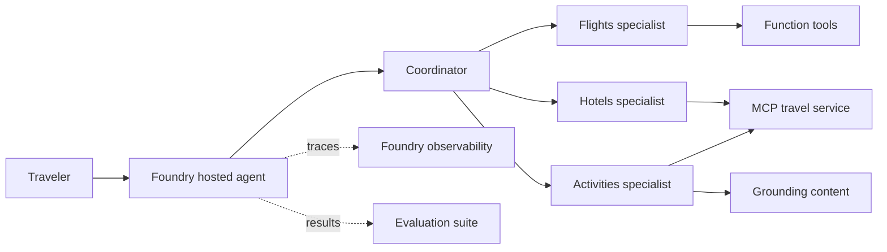

Build a four-agent travel-planning solution with Microsoft Agent Framework and
Microsoft Foundry. You will add function and MCP tools, ground recommendations
with destination content, deploy the workflow as a hosted agent, inspect its
distributed traces, and compare evaluation results after an improvement.

[](https://github.com/tmathew1000/foundry-multi-agent-developer-lab/actions/workflows/validate.yml)

> [!IMPORTANT]
> This is a four-hour self-paced lab. Follow the required path in order. Optional
> challenges do not block later modules.

## What you will accomplish

By the end of the lab, you will be able to:

* Explain the responsibilities of Microsoft Foundry and Microsoft Agent Framework
* Extend an agent with a Python function tool, a remote MCP tool, and grounding
* Coordinate four logical agents with `GroupChatBuilder`
* Expose the workflow as one hosted agent with `workflow.as_agent()`
* Follow coordinator, specialist, model, and tool calls in a Foundry trace
* Evaluate agent behavior and compare a baseline with an improved candidate
* Use managed identity and environment-based configuration

## The solution you will build



Four logical Agent Framework agents run behind one Foundry hosted-agent
deployment. The coordinator routes work to specialists and synthesizes the final
itinerary.

## Platform responsibilities

| Microsoft Agent Framework | Microsoft Foundry |
| --------------------------- | ------------------- |
| Defines agents in code | Provides the project and model deployment |
| Registers tools and context | Hosts the containerized workflow |
| Coordinates specialist agents | Manages identity and connections |
| Builds the group-chat workflow | Collects OpenTelemetry traces |
| Exposes the workflow as an agent | Runs and compares evaluations |

## Schedule

| Module | Activity | Time |
| -------- | ---------- | -----: |
| 0 | Orient, validate, and start provisioning | 15 minutes |
| 1 | Explore and invoke the baseline agent | 30 minutes |
| 2 | Add tools and grounding | 40 minutes |
| 3 | Build the four-agent workflow | 55 minutes |
| Break | Pause | 10 minutes |
| 4 | Deploy and diagnose with tracing | 35 minutes |
| 5 | Evaluate and improve | 40 minutes |
| 6 | Review and remove resources | 15 minutes |
| Buffer | Recovery and service delays | 20 minutes |

## Start here

1. Review the [prerequisites](docs/prerequisites.md).
2. Open the repository in GitHub Codespaces.
3. Begin [Module 0: Orientation and preflight](docs/00-orientation.md).

## Core and optional paths

Each module labels its work:

* Required steps form the four-hour path.
* Optional challenges extend the same concept without blocking later work.
* Checkpoint recovery restores the expected module state.

If an Azure policy, quota, or capacity restriction blocks deployment, use the
saved trace and evaluation artifacts referenced in the module. You can still
complete the diagnostic and evaluation learning outcomes.

## Cost and cleanup

Budget approximately USD 3 to USD 5 for the expected five-hour resource lifetime,
with USD 7 as a conservative allowance. Actual cost depends on model pricing,
tokens, region, and retries.

Run cleanup at the end of the lab:

```bash
azd down --purge
```

Confirm the resource group is removed before closing your Codespace.

## Repository structure

```text
docs/                 Participant and instructor guides
src/travel_buddy/     Hosted multi-agent application
src/mcp_server/       Remote travel MCP service
data/                 Grounding and evaluation datasets
scripts/              Preflight, verification, and recovery commands
checkpoints/          Known-good module solutions
tests/                Offline unit and contract tests
```

## Scope

The required path focuses on hosted agents, tools, grounding, orchestration,
tracing, and evaluation. Private networking, CI/CD, fine-tuning, durable
workflows, voice, and production-scale operations are intentionally outside the
four-hour path.

## Attribution

The lab is an original, focused learning path informed by:

* [Foundry hosted agents with Agent Framework workshop](https://github.com/Azure-Samples/foundry-hosted-agents-workshop)
* [Microsoft Foundry end-to-end agent observability workshop](https://github.com/Azure-Samples/microsoft-foundry-e2e-agent-observability-workshop)

See [Third-party notices](THIRD_PARTY_NOTICES.md) for license details.
