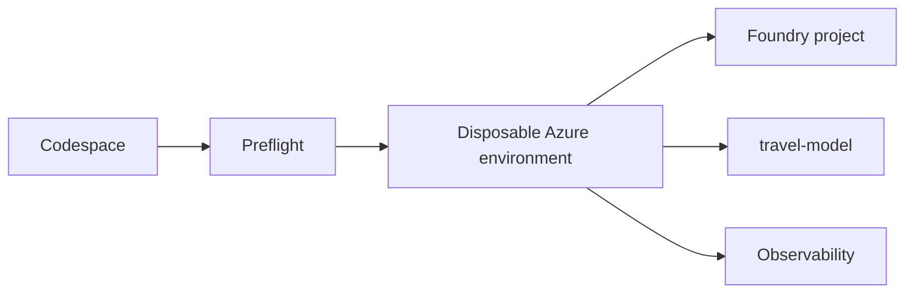

## Outcome

You will validate your environment, start provisioning, and identify the
responsibility of every major solution component.

Estimated time: 15 minutes of active work, plus 20 to 30 minutes for
provisioning.

## Architecture change



Provisioning automates infrastructure so the remaining modules can focus on
agent engineering.

## Required: open the development environment

Create a Codespace from the repository's default branch. Wait until the
post-create task completes.

Open a terminal and confirm the tools are available:

```bash
python --version
az --version
azd version
```

## Required: sign in

```bash
az login --use-device-code
azd auth login --use-device-code
```

Select the subscription you intend to use:

```bash
az account set --subscription "<subscription-name-or-id>"
az account show --output table
```

## Required: run preflight

```bash
python scripts/preflight.py
```

Expected result:

```text
[OK] python>=3.11: Python 3.11 or later
[OK] azure-cli: <path-to-az>
[OK] azd: <path-to-azd>
[OK] azure-login: Signed in to tenant <tenant-id>.
[OK] enabled-subscription: <subscription-name> (<subscription-id>)
[CAVEAT] role-assignments: ...
[CAVEAT] regional-quota: ...
[CAVEAT] azure-policy: ...
```

> [!CAUTION]
> Stop if quota, role assignment, policy, or subscription-state checks fail.
> Follow the remediation printed by the script. Do not bypass organizational
> controls.

## Required: start provisioning

Initialize the environment:

```bash
azd env new
```

Use a short environment name such as `travelbuddy-lab`.

Provision and deploy:

```bash
azd up
```

Provisioning may take 20 to 30 minutes. Continue with the architecture review
while the command runs. If `azd up` requires your terminal, open a second
terminal for the next section.

> [!IMPORTANT]
> Wait for `azd up` to report that provisioning and deployment succeeded before
> running Module 0 verification. The verification requires the deployed
> Foundry project, `travel-model` deployment, and remote MCP endpoint.

The MCP container image builds remotely in Azure. Codespaces does not require
a local Docker or Podman installation for this deployment.

## Understand what is automated

The deployment creates:

* Foundry project and model deployment
* Hosted-agent runtime resources
* Managed identities and required roles
* Scale-to-zero MCP hosting
* Application Insights and Log Analytics
* Supporting container and storage resources

You will manually implement agent behavior, capability selection,
orchestration, trace diagnosis, and evaluation-driven improvement.

Review the [architecture diagrams](architecture.md), then answer:

1. Which platform defines the four logical agents?
2. Which platform hosts the complete workflow?
3. Why is the MCP server remote rather than bound to `localhost`?

Answers:

1. Microsoft Agent Framework defines the logical agents.
2. Microsoft Foundry hosts the workflow as one hosted agent.
3. A hosted agent cannot reach a server running inside your Codespace through
   its local loopback interface.

## Verify your work

Confirm that `azd up` completed successfully, then run:

```bash
python scripts/verify_module.py 0
```

Expected result:

```text
PASS Module 0: local tools and deployed Azure context are ready
```

This verification reads the active `azd` environment and requires the Foundry
project endpoint, model deployment, and remote MCP endpoint.

## Troubleshooting

If Azure authentication expires, repeat both sign-in commands.

If `azd up` reports that neither Docker nor Podman is installed, pull the latest
repository changes and confirm that `docker.remoteBuild` is set to `true` for
the `mcp-server` service in `azure.yaml`. Then rerun `azd up`.

If `azd up` reports that `infra/main.bicep` is missing, pull the latest
repository changes. Confirm that `azure.yaml` defines the `foundry` and `mcp`
infrastructure layers, then rerun `azd up` with the existing environment.

If `azd up` reports `AKSCapacityHeavyUsage` or that cluster creation is
unavailable, select an alternate supported region and rerun provisioning. For
example:

```bash
azd env set AZURE_LOCATION eastus2
azd up
```

If model capacity is unavailable, select an alternate region that supports the
configured model and rerun provisioning. Do not substitute an untested model.

If verification cannot resolve the model deployment, pull the latest repository
changes and confirm that `AI_PROJECT_DEPLOYMENTS` appears in `azd env
get-values`. Then redeploy the hosted agent and verify again:

```bash
azd deploy travel-buddy
python scripts/verify_module.py 0
```

If policy or permissions block provisioning, follow the fallback path in
[Troubleshooting](troubleshooting.md).

## Completion check

Continue when:

* Preflight reports ready or you have selected the fallback path
* Provisioning and deployment have completed successfully
* Module 0 verification passes
* You can explain Foundry versus Agent Framework responsibilities

Next: [Module 1 - Explore the baseline hosted agent](01-baseline.md).
