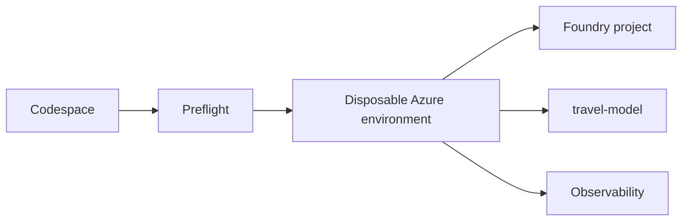

## Outcome

You will validate your environment, start provisioning, and identify the
responsibility of every major solution component.

Estimated time: 15 minutes.

## Architecture change



Provisioning automates infrastructure so the remaining modules can focus on
agent engineering.

## Required: open the development environment

Create a Codespace from the repository's default branch. Wait until the
post-create task completes.

Open a terminal and confirm the tools are available:

```bash
python --version
az --version
azd version
```

## Required: sign in

```bash
az login --use-device-code
azd auth login --use-device-code
```

Select the subscription you intend to use:

```bash
az account set --subscription "<subscription-name-or-id>"
az account show --output table
```

## Required: run preflight

```bash
python scripts/preflight.py
```

Expected result:

```text
PASS  Python
PASS  Azure CLI
PASS  Azure Developer CLI
PASS  Azure sign-in
PASS  Subscription state
CAVEAT  Verify role-assignment capability
CAVEAT  Verify model quota and Azure Policy
READY Provisioning prerequisites passed
```

> [!CAUTION]
> Stop if quota, role assignment, policy, or subscription-state checks fail.
> Follow the remediation printed by the script. Do not bypass organizational
> controls.

## Required: start provisioning

Initialize the environment:

```bash
azd env new
```

Use a short environment name such as `travelbuddy-lab`.

Provision and deploy:

```bash
azd up
```

Provisioning may take 20 to 30 minutes. Continue with the architecture review
while the command runs. If `azd up` requires your terminal, open a second
terminal for the next section.

The MCP container image builds remotely in Azure. Codespaces does not require
a local Docker or Podman installation for this deployment.

## Understand what is automated

The deployment creates:

* Foundry project and model deployment
* Hosted-agent runtime resources
* Managed identities and required roles
* Scale-to-zero MCP hosting
* Application Insights and Log Analytics
* Supporting container and storage resources

You will manually implement agent behavior, capability selection,
orchestration, trace diagnosis, and evaluation-driven improvement.

Review the [architecture diagrams](architecture.md), then answer:

1. Which platform defines the four logical agents?
2. Which platform hosts the complete workflow?
3. Why is the MCP server remote rather than bound to `localhost`?

Answers:

1. Microsoft Agent Framework defines the logical agents.
2. Microsoft Foundry hosts the workflow as one hosted agent.
3. A hosted agent cannot reach a server running inside your Codespace through
   its local loopback interface.

## Verify your work

```bash
python scripts/verify_module.py 0
```

Expected result:

```text
PASS Module 0: local tools and Azure context are ready
```

## Troubleshooting

If Azure authentication expires, repeat both sign-in commands.

If `azd up` reports that neither Docker nor Podman is installed, pull the latest
repository changes and confirm that `docker.remoteBuild` is set to `true` for
the `mcp-server` service in `azure.yaml`. Then rerun `azd up`.

If model capacity is unavailable, choose the documented secondary region and
rerun provisioning. Do not substitute an untested model.

If policy or permissions block provisioning, follow the fallback path in
[Troubleshooting](troubleshooting.md).

## Completion check

Continue when:

* Preflight reports ready or you have selected the fallback path
* Provisioning is running or complete
* You can explain Foundry versus Agent Framework responsibilities

Next: [Module 1 - Explore the baseline hosted agent](01-baseline.md).
