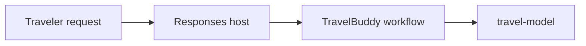

## Outcome

You will identify the parts of a code-first agent, invoke it locally, and connect
the source definition to its Foundry hosted deployment.

Estimated time: 30 minutes.

## Architecture change



The caller sees one hosted endpoint backed by one model deployment. Agent
Framework manages the logical coordinator and specialists inside that endpoint.

## Required: inspect the agent

Open `src/travel_buddy/agents.py`.

Find these elements:

* `AgentSpec` separates each role's name, description, instructions, and tools.
* The coordinator and specialists have distinct capability boundaries.
* Environment variables keep deployment-specific values outside source code.

Open `src/travel_buddy/workflow.py`.

Find:

* `FoundryChatClient`, which connects each logical agent to `travel-model`
* `GroupChatBuilder`, which constructs the multi-agent workflow
* `workflow.as_agent()`, which exposes the workflow as one agent

Open `main.py` and `src/travel_buddy/hosting.py`. Find
`ResponsesHostServer`, which exposes the application through the hosted
Responses protocol.

## Required: run the offline contract tests

```bash
python -m pytest tests/test_config.py tests/test_workflow.py
```

The tests do not call Azure. They verify the application contract and allow the
lab to detect source errors before a deployment.

Expected result:

```text
........                                                                 [100%]
8 passed in ...s
```

## Required: run the baseline

After `azd up` completes, import the environment:

```bash
azd env get-values > .env
```

Start the local host:

```bash
python main.py
```

Leave that terminal running. When the server reports that it is listening on
port `8088`, open a second PowerShell terminal and invoke the Responses
endpoint:

```powershell
$body = @{
    input = "Plan a three-day trip to Tokyo."
} | ConvertTo-Json

$response = Invoke-RestMethod `
    -Uri "http://127.0.0.1:8088/responses" `
    -Method Post `
    -ContentType "application/json" `
    -Body $body

$response.output.content.text
```

On macOS or Linux, use `curl` from a second terminal:

```bash
curl --request POST http://127.0.0.1:8088/responses \
  --header "Content-Type: application/json" \
  --data '{"input":"Plan a three-day trip to Tokyo."}'
```

To use Foundry Agent Inspector instead:

1. Confirm that the Foundry Toolkit extension is installed in VS Code.
2. Leave `python main.py` running.
3. Press `Ctrl+Shift+P` to open the Command Palette.
4. Run `Foundry Toolkit: Open Agent Inspector`. In older extension versions,
   run `AI Toolkit: Open Test Tool`.
5. Connect the inspector to port `8088`, or enter
   `http://127.0.0.1:8088` if it requests a server URL.
6. Send:

```text
Plan a three-day trip to Tokyo.
```

Expected behavior:

* TravelBuddy returns one consolidated response.
* The coordinator selects specialists based on the request.
* The hosted endpoint hides the internal multi-agent graph from the caller.

Stop the local host with `Ctrl+C`.

## Required: connect code to Foundry

Open your Foundry project and locate:

* The `travel-model` deployment
* The TravelBuddy hosted agent
* The hosted agent version
* The Responses protocol

Do not edit the agent in the portal. The source repository is authoritative.

## Why this matters

A hosted agent is not the same as a prompt stored only in a portal. The
deployment runs your containerized Python application, which gives you control
over libraries, orchestration, tools, and runtime behavior.

## Verify your work

```bash
python scripts/verify_module.py 1
```

Expected result:

```text
PASS Module 1: baseline agent contract is valid
```

## Recovery

Module 1 does not require source changes. If an optional experiment breaks the
agent specification, discard that edit and rerun the focused tests before
continuing.

## Optional challenge

Change one sentence in the baseline instructions and observe how the response
changes. Revert the experiment before Module 2.

## Completion check

Continue when:

* Baseline tests pass
* You have invoked TravelBuddy
* You can identify its model client, agent specifications, workflow, and hosting
  adapter

Next: [Module 2 - Add tools and grounding](02-tools-grounding.md).
