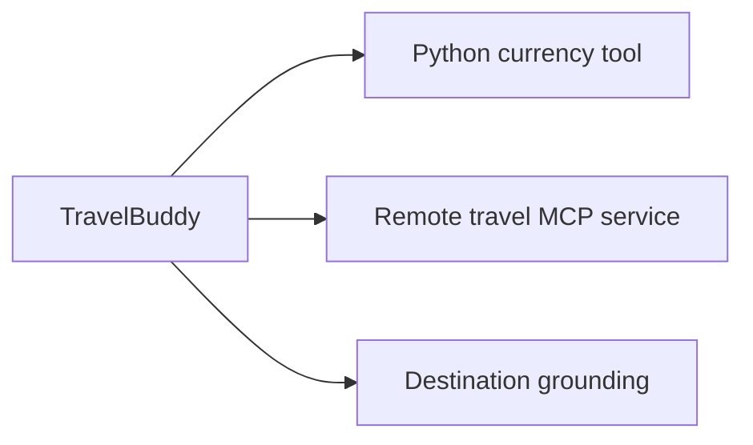

## Outcome

You will implement a function tool, inspect an MCP operation, and distinguish
actions from grounding context.

Estimated time: 40 minutes.

## Architecture change



Function tools execute application code. MCP exposes remote capabilities through
a standard protocol. Grounding contributes relevant context before generation.

## Required: implement the currency tool

Prepare the focused starter for this module:

```bash
python scripts/start_module.py 2
```

The command replaces only `src/travel_buddy/tools.py` and reports the file it
prepared.

Open `src/travel_buddy/tools.py` and locate the TODO in `convert_currency`.

Implement these behaviors:

1. Normalize currency codes to uppercase.
2. Validate both codes against the supported-rate map.
3. Convert the source amount to USD.
4. Convert USD to the target currency.
5. Return the input, output, rate, and workshop-data notice.

Run the focused tests:

```bash
pytest tests/test_tools.py -q
```

Expected result:

```text
passed
```

## Required: inspect the MCP capability

Open `src/mcp_server/server.py`.

Find the operation that returns hotel and activity information. Notice:

* The schema describes arguments and results.
* The hosted agent reaches an HTTPS endpoint.
* The operation owns travel data access, not conversation orchestration.

Test its pure data layer:

```bash
pytest tests/test_mcp_server.py -q
```

## Required: inspect grounding

Open `data/destinations.json`.

Compare the three capability types:

| Capability | Best for | Example |
| ------------ | ---------- | --------- |
| Function tool | Deterministic local action | Convert a known amount |
| MCP tool | Remote or reusable operation | Search lodging inventory |
| Grounding | Inject relevant source context | Recommend a neighborhood |

Open `src/travel_buddy/integrations.py` and find where destination retrieval is
constructed. Then open `src/travel_buddy/agents.py` and identify which
specialists receive that capability.

The lab uses an Agent Framework `ContextProvider` over curated local records so
the exercise remains reliable in four hours. A production solution can replace
the provider with Foundry File Search or Azure AI Search without changing the
specialist boundaries.

## Required: verify behavior

Start the local host, then send:

```text
I have a hotel budget of 200 EUR per night for Tokyo. Convert it to JPY and
recommend an area with evening dining.
```

Expected behavior:

* The currency function is called.
* The lodging operation is selected when appropriate.
* Destination guidance is grounded in the supplied data.
* The answer labels workshop or mock data clearly.

## Why this matters

Giving every agent every capability increases cost, ambiguity, and attack
surface. Later, you will assign only the required capabilities to each
specialist.

## Verify your work

```bash
python scripts/verify_module.py 2
```

Expected result:

```text
PASS Module 2: function, MCP, and grounding contracts are valid
```

## Checkpoint recovery

```bash
python scripts/restore_checkpoint.py 2
```

The restore command replaces only the workshop-owned source file for this
module.

## Optional challenge

Add another supported currency and its unit test. Keep the exchange rate clearly
marked as workshop data.

## Completion check

Continue when:

* Tool and MCP tests pass
* You can explain when to use a tool instead of grounding
* You have observed at least one tool call

Next: [Module 3 - Build the multi-agent workflow](03-multi-agent.md).
