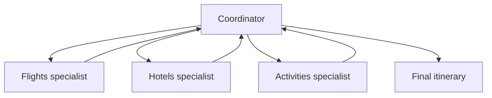

## Outcome

You will complete the fourth logical agent, register all specialists with
`GroupChatBuilder`, and expose the workflow as one hosted agent.

Estimated time: 55 minutes.

## Architecture change



The coordinator is the group-chat manager. It selects one specialist at a time
and terminates when the request has been answered.

## Required: inspect specialization

Prepare the focused starters:

```bash
python scripts/start_module.py 3
```

The command replaces `src/travel_buddy/agents.py` and
`src/travel_buddy/workflow.py` with the module starters.

Open `src/travel_buddy/agents.py` and `src/travel_buddy/workflow.py`.

Review the existing roles:

* Coordinator routes and synthesizes but owns no business tool.
* Flights specialist owns deterministic flight-related function tools.
* Hotels specialist owns lodging MCP access and destination grounding.

The specialist descriptions are part of the routing signal. Keep them short and
distinct.

## Required: complete the Activities specialist

Locate the Activities TODO and create an `AgentSpec` with:

* Name `ActivitiesSpecialist`
* A concise routing description
* Instructions limited to experiences, day trips, and itineraries
* Activity MCP capability
* Destination grounding provider
* Stateless model options used by the other specialists

Do not give it flight-specific tools.

Run:

```bash
python -m pytest tests/test_agents.py
```

## Required: register the specialist

Locate the group-chat TODO.

Add the Activities specialist to the participants passed to
`GroupChatBuilder`. Preserve the Coordinator as `orchestrator_agent`.

Build the workflow and return:

```python
workflow.as_agent()
```

The hosted runtime sees one agent endpoint even though Agent Framework runs four
logical agents.

## Required: test routing

Run:

```bash
python -m pytest tests/test_workflow.py
```

Then invoke these prompts:

```text
Convert 500 USD to JPY for my Tokyo trip.
```

```text
Plan a four-day Tokyo trip from Lisbon with a hotel near evening dining and one
day trip.
```

Expected behavior:

* The focused currency request does not require all specialists.
* The complete request routes to Flights, Hotels, and Activities.
* The coordinator returns one consolidated response.

## Understand the orchestration trade-off

Manager-led group chat provides dynamic routing and visible specialist
boundaries. It also adds model calls, latency, and possible routing errors.

Use a deterministic workflow when the sequence must always be fixed. Use
manager-led orchestration when the required specialists depend on the request.

## Verify your work

```bash
python scripts/verify_module.py 3
```

Expected result:

```text
PASS Coordinator registered
PASS FlightsSpecialist registered
PASS HotelsSpecialist registered
PASS ActivitiesSpecialist registered
PASS Workflow exposed as an agent
```

## Checkpoint recovery

```bash
python scripts/restore_checkpoint.py 3
```

Rerun the focused agent and orchestration tests after restoration.

## Optional challenge

Add a test asserting that a lodging-only request does not need the Flights
specialist. Do not change the required routing policy.

## Completion check

Continue when:

* Four logical agents are registered
* The orchestration tests pass
* You can explain why there is only one hosted deployment

Next: [Module 4 - Deploy and diagnose with tracing](04-deploy-trace.md).
