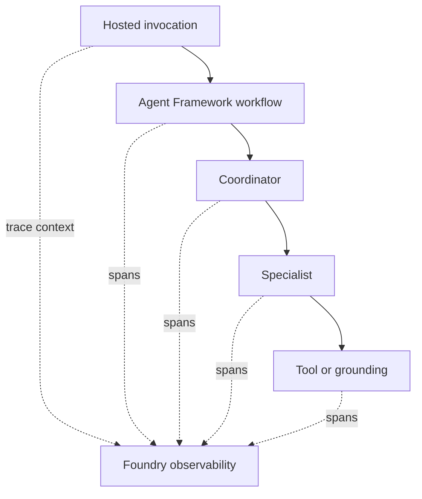

## Outcome

You will deploy the completed workflow, follow its distributed trace, and use
evidence to diagnose a controlled tool failure.

Estimated time: 35 minutes.

## Architecture change



Trace context connects the hosted request to Agent Framework, model, tool, MCP,
and grounding activity.

## Required: deploy the candidate

Run the complete local verification before deployment:

```bash
pytest -q
python scripts/verify_module.py 3
```

Deploy:

```bash
azd deploy
```

Wait until the hosted-agent status reports ready. A deployment that was accepted
but is still starting is not ready for invocation.

## Required: generate a trace

Invoke the deployed agent with:

```text
Plan four days in Tokyo from Lisbon. Keep the hotel under 200 EUR per night,
include a day trip, and show major prices in JPY.
```

Save the response ID printed by the invocation helper.

## Required: inspect the trace

In Microsoft Foundry:

1. Open the project.
2. Open observability and traces.
3. Filter to the TravelBuddy agent and recent time range.
4. Open the trace matching the saved response ID.

Find:

* Hosted invocation
* Agent Framework workflow
* Coordinator decisions
* Selected specialists
* Model calls
* Function and MCP calls
* Grounding retrieval
* Final synthesis

Record:

* Which specialist ran first
* Which operation had the highest latency
* Whether an unnecessary specialist ran
* Token usage for the complete request

## Required: diagnose the controlled failure

Invoke:

```text
Convert my Tokyo hotel budget of 200 CAD per night to JPY.
```

The starter currency tool intentionally supports a limited set of currencies.
Use the trace to answer:

1. Did routing select the expected specialist?
2. Did the model form valid tool arguments?
3. Did the tool execute?
4. What result or error did the tool return?
5. Did the final response represent the limitation accurately?

The correct diagnosis is based on the tool span, not on the wording of the final
answer alone.

## Why this matters

Agent responses hide execution details. Distributed tracing separates routing,
model reasoning, external dependencies, and application code so you can improve
the correct layer.

## Verify your work

```bash
python scripts/verify_module.py 4
```

Expected result:

```text
PASS Module 4: tracing configuration is present
```

The script verifies instrumentation configuration. You must inspect the live
trace to complete the learning outcome.

## Fallback artifact

If trace ingestion is delayed, open `artifacts/traces/controlled-failure.json`.
Follow the same diagnostic questions and return to the live trace if it appears.

## Optional challenge

Compare specialist span durations and propose one capability assignment that
would reduce latency without reducing answer quality.

## Completion check

Continue when:

* The candidate version is deployed
* You have followed one complete trace
* You have diagnosed the unsupported-currency failure

Next: [Module 5 - Evaluate and improve](05-evaluate-improve.md).
