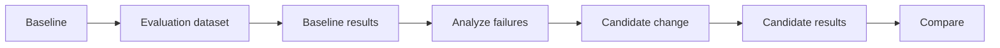

## Outcome

You will run a small evaluation suite, identify one failure pattern, change one
instruction, and compare the candidate with the baseline.

Estimated time: 40 minutes.

## Architecture change



Evaluation converts agent improvement from intuition into a repeatable
measurement.

## Required: inspect the dataset

Open `evaluations/travel_buddy_cases.jsonl`.

The cases cover:

* Focused requests that need one specialist
* Complete itineraries that need all specialists
* Tool selection
* Grounded recommendations
* Unsupported input
* Requests that should not trigger unnecessary tools

Keep the dataset small for predictable lab duration.

## Required: understand the metrics

The lab combines deterministic and model-based checks:

| Metric | Question |
| -------- | ---------- |
| Task completion | Did the response answer the request? |
| Task adherence | Did the agent follow the requested constraints? |
| Tool selection | Was the correct capability selected? |
| Tool-call accuracy | Were tool arguments valid? |
| Tool success | Did the operation complete successfully? |
| Groundedness | Are recommendations supported by supplied context? |
| Relevance | Is the final response focused on the request? |

The Foundry run uses agent and quality evaluators. The evaluation helper also
checks required and forbidden response terms deterministically, which reduces
dependence on an LLM judge.

## Required: run the baseline

Run:

```bash
python scripts/run_evaluation.py --label baseline
```

Open the evaluation result in Foundry and identify:

* Lowest-scoring case
* Failed deterministic assertion
* Specialist or tool involved
* Trace linked to the failure, when available

## Required: make one improvement

Use the supplied baseline failure involving an unnecessary specialist or
unsupported currency.

Change one instruction in `src/travel_buddy/agents.py`. Do not change the
dataset to make the score pass.

A good change:

* Is specific to the observed failure pattern
* Preserves unrelated routing behavior
* Can be explained in one sentence

Run the offline tests:

```bash
pytest tests/test_workflow.py -q
```

## Required: run and compare the candidate

Deploy the changed agent and refresh the local environment values:

```bash
azd deploy travel-buddy
azd env get-values > .env
```

Confirm that `AGENT_TRAVEL_BUDDY_VERSION` changed. The evaluation comparison is
meaningful only when baseline and candidate target different agent versions.

```bash
python scripts/run_evaluation.py --label candidate
python scripts/compare_evaluations.py baseline candidate
```

Expected result:

```text
Metric                 Baseline   Candidate   Change
Task completion        ...        ...         ...
Tool selection         ...        ...         ...
Tool success           ...        ...         ...
Groundedness           ...        ...         ...
```

Confirm that the targeted metric improves without a meaningful regression in
the other required metrics.

## Avoid judge bias

The lab may use the same model family for generation and selected judge-based
evaluators to keep quota and setup simple. Production evaluations should
consider:

* An independently selected judge model
* Deterministic checks
* Human review
* Larger and versioned datasets
* Safety and adversarial testing

## Verify your work

```bash
python scripts/verify_module.py 5
```

Expected result:

```text
PASS Module 5: baseline and candidate results are comparable
```

## Fallback artifact

If the evaluation service is delayed, compare:

* `artifacts/evaluations/baseline.json`
* `artifacts/evaluations/candidate.json`

Use them to complete the analysis, but do not present them as results from your
deployment.

## Optional challenge

Add one focused evaluation case for a travel constraint that matters to your
own application domain.

## Completion check

Continue when:

* You have identified a measured failure
* You have changed one instruction
* You have compared baseline and candidate results

Next: [Module 6 - Review and clean up](06-review-cleanup.md).
