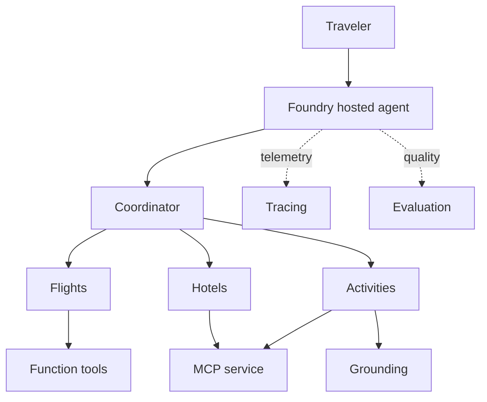

## Outcome

You will connect the implementation to the platform features, verify the final
solution, and remove all disposable resources.

Estimated time: 15 minutes.

## Final architecture



## Required: run final verification

```bash
pytest -q
python scripts/verify_module.py all
```

Do not continue to cleanup until you have recorded any results or screenshots
you want to retain.

## Required: explain the solution

Confirm that you can answer:

1. Why are four logical agents represented by one hosted endpoint?
2. When should an application use a function tool, MCP, or grounding?
3. What does `GroupChatBuilder` contribute?
4. What does `workflow.as_agent()` contribute?
5. How does trace evidence differ from final-response inspection?
6. Why compare evaluation versions instead of testing a few prompts manually?

## Feature map

| Feature | Where you used it |
| --------- | ------------------- |
| Foundry project | Shared boundary for model, agent, traces, and evaluations |
| Model deployment | Inference for coordinator and specialists |
| Hosted agent | Managed execution of the containerized workflow |
| Agent Framework | Code-first agents and multi-agent orchestration |
| Function tool | Deterministic currency operation |
| MCP | Remote reusable travel operations |
| Grounding | Destination context |
| Managed identity | Authentication without API keys |
| Tracing | Runtime diagnosis |
| Evaluation | Baseline and candidate quality comparison |

## Required: remove resources

Capture the resource-group name before teardown:

```bash
RESOURCE_GROUP="$(azd env get-value AZURE_RESOURCE_GROUP)"
```

Run:

```bash
azd down --purge
```

Confirm when prompted.

Verify the resource group no longer exists:

```bash
az group show --name "$RESOURCE_GROUP"
```

The expected result is a resource-not-found error.

> [!CAUTION]
> Closing the Codespace does not remove Azure resources. Verify cleanup to stop
> ongoing charges.

## Retain the learning, not the environment

You can now apply the pattern to another scenario:

1. Define specialist boundaries around business responsibilities.
2. Assign each capability only where needed.
3. Select deterministic or dynamic orchestration deliberately.
4. Instrument the complete request path.
5. Create evaluation cases from real requirements and failures.
6. Improve one measured behavior at a time.

## Optional next steps

Explore these topics after the lab:

* Durable workflows and checkpointing
* Agent memory
* Continuous evaluation
* CI/CD and version promotion
* Private networking
* Safety and red-team evaluation
* Model comparison

## Lab complete

You have built, hosted, traced, evaluated, and improved a multi-agent solution
with Microsoft Foundry and Microsoft Agent Framework.
