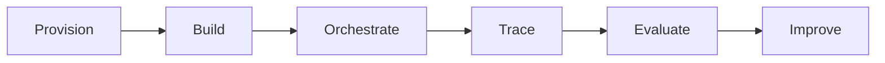
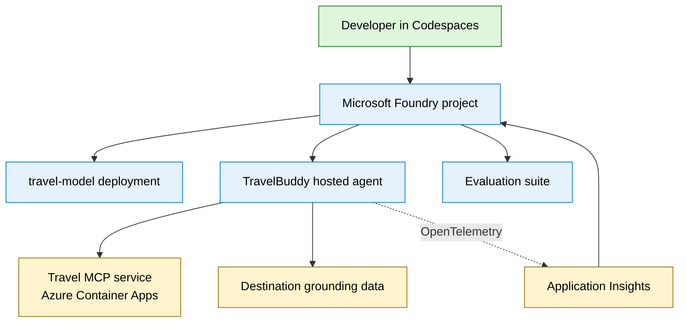
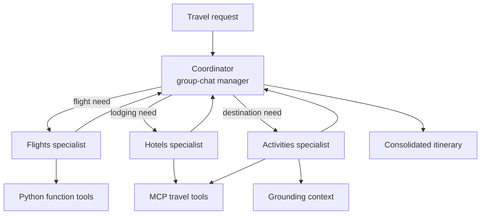
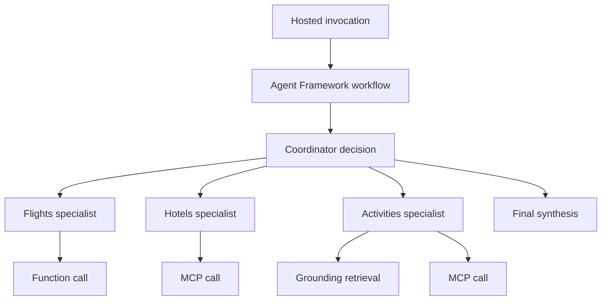
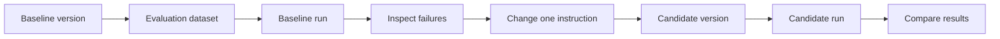

## Learning journey

You will complete one development lifecycle rather than a collection of
unrelated demonstrations.

## Deployed architecture

Green identifies the participant environment. Blue identifies Foundry-managed
resources. Gold identifies supporting Azure resources.

## Multi-agent workflow

The coordinator and specialists are four logical agents. Foundry hosts the
complete graph as one deployment.

## Capability ownership

| Agent | Responsibility | Capabilities |
| ------- | ---------------- | -------------- |
| Coordinator | Route and synthesize | Routing and termination |
| Flights | Flights, timing, weather, and currency | Python function tools |
| Hotels | Lodging areas, budgets, and trade-offs | MCP and grounding |
| Activities | Experiences and day-by-day plans | MCP and grounding |

The division is intentionally visible so you can reason about routing and inspect
each specialist in a trace.

## Trace hierarchy

The span hierarchy mirrors the code and makes routing, tool selection, failures,
latency, and token use observable.

## Evaluation loop

The lab ends with a measured improvement. It does not rely on subjective prompt
testing alone.
